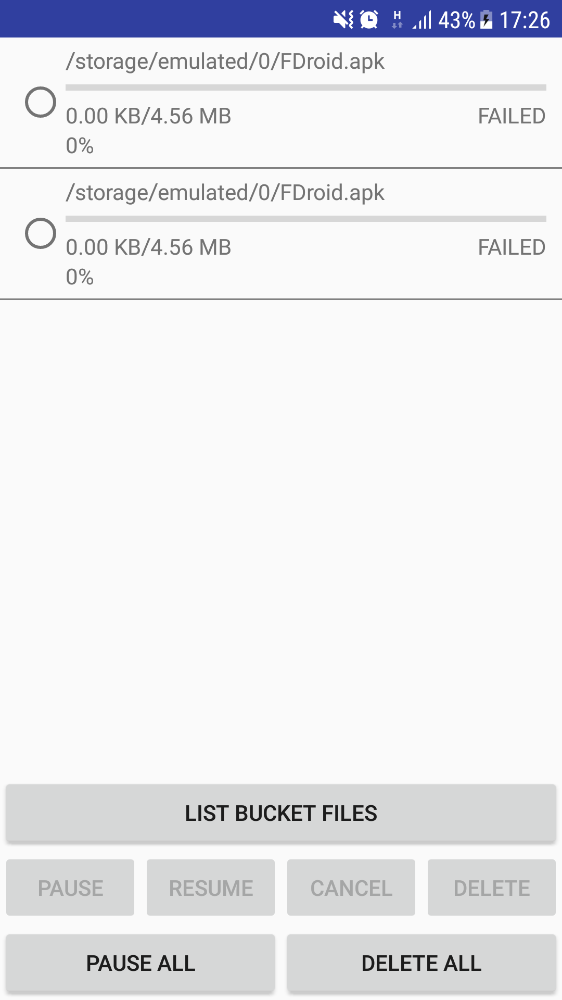
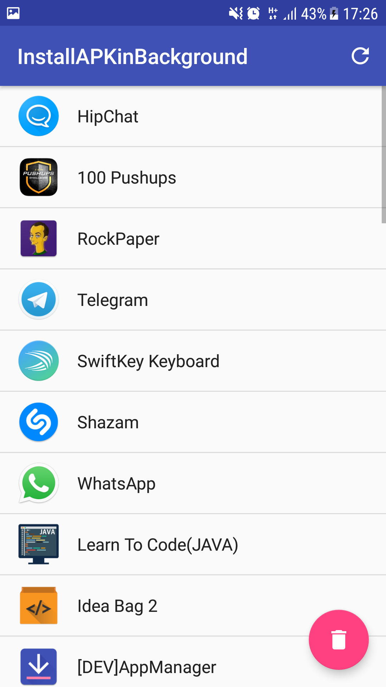

## Android-InstallInBackground

This is improvement Version of [paulononaka/Android-InstallInBackgroundSample](https://github.com/paulononaka/Android-InstallInBackgroundSample)

## Changes by ME (https://github.com/GuessWh0o)

- Listing installed apps
- Added option to uninstall app in background
- Downloading apks from Amazon S3

// In progress "Downloading and Installing Apk from any link.

## Changes by WindSekirun

- Enable Gradle Build System instead of ADT
- Change Layout Position
- Up to SDK Version / min: 8 -> 15 / target: 8 -> 23

## License & DISCLAMER

I'm not owner of this code. if you have any issue of this code, please notice to @paulononaka , not me.
and, I follow owner's license policy.

***

### Amazon S3 Activity

***

***

### Uninstall Activity

***
